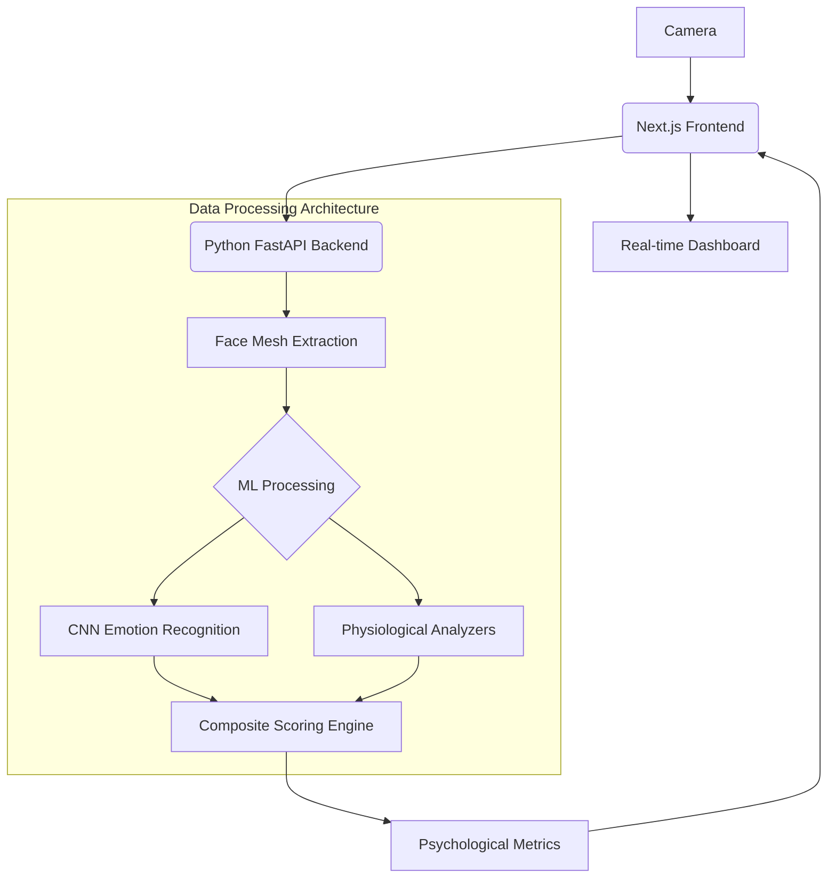
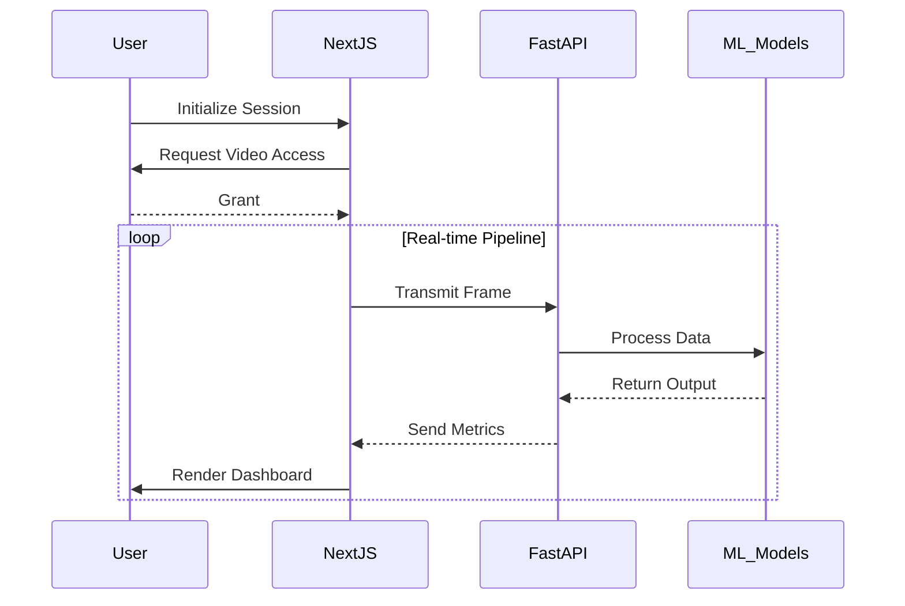

```mermaid
graph TD
    A[Camera] --> B(Next.js Frontend)
    B --> C(Python FastAPI Backend)
    
    subgraph Data Processing Architecture
    C --> D[Face Mesh Extraction]
    D --> E{ML Processing}
    E --> F[CNN Emotion Recognition]
    E --> G[Physiological Analyzers]
    F & G --> H[Composite Scoring Engine]
    end
    
    H --> I[Psychological Metrics]
    I --> B
    B --> J[Real-time Dashboard]
```

```mermaid
sequenceDiagram
    participant User
    participant NextJS
    participant FastAPI
    participant ML_Models
    
    User->>NextJS: Initialize Session
    NextJS->>User: Request Video Access
    User-->>NextJS: Grant
    
    loop Real-time Pipeline
        NextJS->>FastAPI: Transmit Frame
        FastAPI->>ML_Models: Process Data
        ML_Models-->>FastAPI: Return Output
        FastAPI-->>NextJS: Send Metrics
        NextJS->>User: Render Dashboard
    end
```
